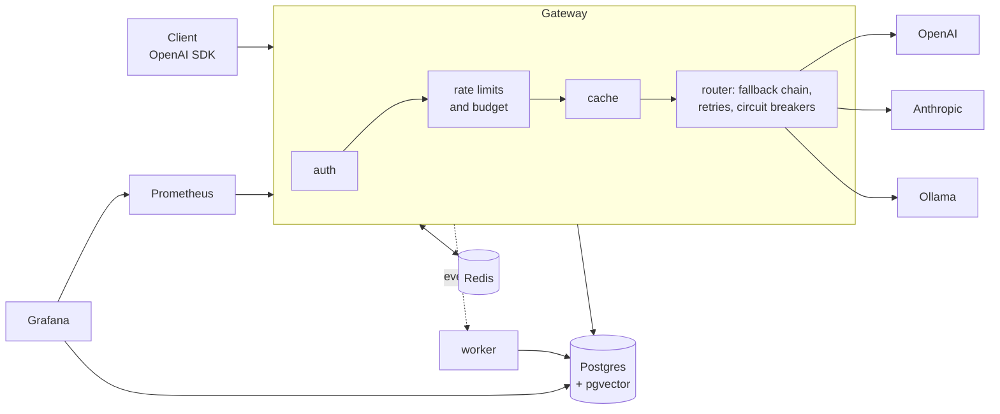

# LLM Gateway

A self-hosted gateway with an OpenAI-compatible API in front of OpenAI,
Anthropic and a local Ollama model. Point any OpenAI SDK at it by changing
`base_url`, and get failover between providers, per-tenant rate limits and
budgets, response caching, cost accounting and dashboards.


*A scripted outage (`python -m bench.chaos`): the primary starts returning
503 at 10 s; traffic moves to the backup before any client sees an error,
and returns when the primary recovers. 2,559 requests during the outage, 0
failed.*

## Results at a glance

Measured on one 4-vCPU VM running everything (load generator, mock provider,
databases, gateway with 2 worker processes). Details and caveats:
[docs/benchmarks.md](docs/benchmarks.md).

| Question | Answer |
|---|---|
| Latency added per request | **+15 ms p50** at 10 concurrent streams, **+37 ms p50** at 100 (realistic 2.3 s streams) |
| Throughput ceiling | ~100–140 new streams/s on 2 processes (~3,000 relayed tokens/s per process); 500+ concurrent streams saturate this box |
| Provider returns 503 / 429 / hangs | **0 failed requests**; breaker opens in 0.4 s (2.5 s for a hang with a 2 s TTFT timeout) |
| Provider dies mid-stream | 0.8% of requests get an explicit error event (can't be hidden once tokens are sent); breaker opens in 0.4 s |
| Recovery after the provider comes back | within one breaker cooldown (15 s); 0.3–4.4 s in the runs |
| Semantic cache threshold | **0.99**, chosen as the lowest with ≤ 2 wrong answers per 1,000 lookups on 20k Quora question pairs |
| Spend saved by caching (FAQ-style workload) | **53.2%** exact cache, 53.6% with the semantic cache added; 0% on a no-repeat workload |

## Quick start

Needs Docker with Compose. Everything, including the fake provider used for
tests and benchmarks, runs locally:

```bash
git clone https://github.com/shubham0745/LLM-Gateway.git && cd LLM-Gateway
cp .env.example .env        # optional: add OPENAI_API_KEY / ANTHROPIC_API_KEY
docker compose up -d --build

# create a tenant and an API key
docker compose exec gateway python -m gateway.cli create-tenant demo "Demo" --budget 5
docker compose exec gateway python -m gateway.cli create-key demo     # prints gw-...
```

```python
from openai import OpenAI

client = OpenAI(base_url="http://localhost:8080/v1", api_key="gw-...")
for chunk in client.chat.completions.create(
    model="mock",                     # or "fast", "smart", "local", "openai/gpt-4o-mini", ...
    messages=[{"role": "user", "content": "Hello"}],
    stream=True,
):
    if chunk.choices:
        print(chunk.choices[0].delta.content or "", end="")
```

| URL | What |
|---|---|
| http://localhost:8080/v1 | OpenAI-compatible API (`/chat/completions`, `/models`) |
| http://localhost:3000 | Grafana: live traffic and spend dashboards |
| http://localhost:9090 | Prometheus |
| http://localhost:9000 | Mock provider with fault injection (`PUT /control/primary {"mode": "outage"}`) |

Optional local fallback model: `docker compose --profile ollama up -d`
(pulls `qwen2.5:0.5b`, used as the last target of the `fast` and `smart` aliases).

## How it works



A request is authenticated (hashed API key), checked against the tenant's
requests/min, tokens/min and monthly budget (reserved up front, settled to
real usage), looked up in the cache, and routed along its alias's fallback
chain: retry once with jitter, fail over on 5xx/429/timeouts, skip providers
whose circuit breaker is open. Streams are held until the first token, so
failures before it are invisible to the client. Cost is computed from the
provider's reported usage, and every request is logged asynchronously
through a Redis stream.

More: [architecture](docs/architecture.md) · [design decisions](docs/decisions.md) ·
[benchmarks](docs/benchmarks.md) · [deploying on AWS](docs/deploy-aws.md)

## Design decisions (short version)

- **OpenAI's format is the internal standard**; adapters translate at the edge. No LiteLLM or LangChain: the failure handling is the point, so it is written against raw HTTP.
- **Hold the stream until the first token.** Failover is free before it and impossible after it; a stream that fails later ends with an explicit error event, never a silent truncation.
- **Breakers, limits and budgets live in Redis (Lua)**, so every process and host shares them.
- **Reserve the worst case, settle the truth**: a burst of concurrent requests cannot overspend a budget.
- **Config is versioned in Postgres and hot-reloaded** (`PUT /admin/config`); rollback is one call.
- **The semantic-cache threshold is measured, not guessed**, and the cache ships **off**: on a realistic workload it added 0.4 points of hit rate while making every miss ~55 ms slower.

## Configuration

`deploy/config/gateway.yaml` is the seed config (providers, aliases and
their fallback chains, prices, timeouts, retry, breaker, cache, default
limits). After first start it lives in Postgres; change it without a restart:

```bash
curl -s localhost:8080/admin/config -H "authorization: Bearer $GATEWAY_ADMIN_TOKEN" > cfg.json
# edit cfg.json, then:
curl -X PUT localhost:8080/admin/config -H "authorization: Bearer $GATEWAY_ADMIN_TOKEN" \
  -H 'content-type: application/json' --data @cfg.json
```

Admin API (bearer `GATEWAY_ADMIN_TOKEN`): tenants and keys
(`/admin/tenants`, `/admin/tenants/{id}/keys`, `DELETE /admin/keys/{id}`),
config and its versions (`/admin/config`, `/admin/config/versions`,
`POST /admin/config/rollback/{v}`), spend (`GET /admin/usage`, yesterday by
default, `group_by=tenant,model`), one request's attempts
(`/admin/requests/{id}`), breakers (`/admin/circuits`,
`POST /admin/circuits/{provider}/reset`).

Response headers on every call: `x-request-id`, `x-gateway-provider`,
`x-gateway-model`, `x-gateway-attempts`, `x-gateway-cost-usd`,
`x-gateway-cache` (`miss`, `hit-exact`, `hit-semantic`, `bypass`) and the
`x-ratelimit-*` headers. Send `x-gateway-cache: no-cache` (refresh) or
`no-store` (skip entirely) to control caching per request.

## Reproducing the numbers

```bash
pip install -r requirements-dev.txt
python scripts/bootstrap.py          # tenants and keys used by the benchmarks
python -m bench.overhead             # latency overhead at 10/100/500/1000 streams
python -m bench.chaos                # six injected failures
python -m bench.cache_eval           # semantic threshold (needs the QQP download)
python -m bench.cost_replay          # spend with caching off/exact/semantic
```

See [bench/README.md](bench/README.md) for the dataset download and what to
watch out for when reading the results.

## Development

```bash
python -m venv .venv && . .venv/bin/activate
pip install -r requirements-dev.txt
docker compose up -d postgres redis   # or local Postgres 16 with pgvector + Redis
python gateway/cache/embedder.py download models/all-MiniLM-L6-v2   # for semantic-cache tests
ruff check . && pytest -q
```

Tests run the real gateway and the mock provider in-process (82 tests:
OpenAI SDK compatibility per provider, Anthropic translation, retries,
failover, breakers, limits, budgets, admin API, caching). CI runs lint,
tests and a Docker build on every push (`.github/workflows/ci.yml`).

## Project layout

```
gateway/      api/ providers/ routing/ limits/ cache/ accounting/ telemetry/
worker/       event stream -> Postgres, semantic cache writes, expiry
mock_provider/  fake OpenAI/Anthropic API with runtime fault injection
bench/        overhead, chaos, cache accuracy, cost replay, Locust
deploy/       seed config, Prometheus, Grafana dashboards, Caddy, production compose
docs/         architecture, decisions, benchmarks, AWS deploy, demo script, results
```

## Limitations

- Two paid providers (OpenAI, Anthropic) plus Ollama. Tool calls are not
  translated to Anthropic's format yet; such requests fail over to an
  OpenAI-compatible target.
- Routing follows the configured chain; it does not pick the cheapest or
  fastest provider on its own.
- The semantic cache considers single-turn prompts only.
- Throughput per process is modest (Python); scale with `GATEWAY_WORKERS`
  or more hosts.

## Author

**Shubham Kumar** · [LinkedIn](https://www.linkedin.com/in/shubhamkumar-351000334) · [GitHub](https://github.com/shubham0745)
