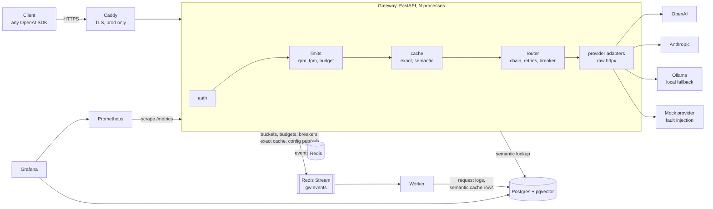

# Architecture

## Components

| Directory | What lives there |
|---|---|
| `gateway/api` | OpenAI-compatible routes, admin API, API-key auth |
| `gateway/providers` | One adapter per API shape (OpenAI-compatible, Anthropic), SSE parsing |
| `gateway/routing` | Alias resolution, fallback chains, retries, timeouts, circuit breakers, versioned config |
| `gateway/limits` | Token-bucket rate limits and monthly budgets (Redis Lua) |
| `gateway/cache` | Exact cache (Redis), semantic cache (ONNX MiniLM + pgvector), lexical guard |
| `gateway/accounting` | Pricing and token estimates |
| `gateway/telemetry` | Prometheus metrics, JSON logs, event batching to the Redis stream |
| `worker/` | Consumes the event stream into Postgres; expires semantic cache rows |
| `mock_provider/` | Fake OpenAI/Anthropic API with runtime fault injection |
| `bench/` | Overhead, chaos, cache accuracy and cost benchmarks |
| `deploy/` | Seed config, Prometheus, Grafana dashboards, Caddy, production compose |

## One request

1. **Authenticate.** `Authorization: Bearer gw-...`. The key is hashed with
   HMAC-SHA256 and a server-side pepper and looked up in Postgres; results are
   cached in-process for up to 30 seconds, and revocations flush every process's
   cache over Redis pub/sub.
2. **Resolve the model.** `model` is an alias from config (`fast`, `smart`,
   `mock`...) that names an ordered chain of `(provider, model)` targets, or
   an explicit `provider/model`.
3. **Admit.** One Lua script takes from the tenant's requests-per-minute and
   tokens-per-minute buckets atomically, charging the prompt estimate plus
   `max_tokens` (or a default completion estimate). A second script reserves
   the worst-case cost against the monthly budget. Both are settled to the
   real usage when the request finishes. Rejections are OpenAI-shaped 429s
   with `retry-after`.
4. **Cache.** Exact: SHA-256 of every field that can change the answer, in
   Redis. Semantic (off by default, see decision 9): for single-turn prompts, embed the user message (about
   8 ms on one CPU thread), find the nearest earlier prompt with the same
   system prompt and parameters in pgvector, accept it above the measured
   threshold (0.99) and only if the lexical guard agrees. Hits are free and
   replayed as a normal response or stream.
5. **Route.** For each target in the chain: skip it if its breaker is open;
   call it with connect, time-to-first-token and idle timeouts; on a retryable
   error retry once with jittered backoff (honouring `Retry-After` up to a
   limit, failing over instead when it asks for longer); otherwise move to the
   next target. Streams are held until the first real token arrives, so every
   failure before that point is invisible to the client.
6. **Relay.** Upstream chunks are converted to OpenAI chunks and written to
   the client as they arrive, one write per upstream network read. A failure
   after the first token ends the stream with an explicit SSE error event (a
   truncated answer must not look complete). A client disconnect closes the
   upstream request so the provider stops generating.
7. **Record.** Cost is computed from the provider's reported usage and the
   price table; the reservation is settled in the background; metrics are
   updated; one event goes onto the Redis stream (batched), and the worker
   writes it to `request_logs`.

## State

| Where | What | If lost |
|---|---|---|
| Postgres | tenants, API keys, versioned config, request logs, semantic cache | the source of truth; back it up |
| Redis | rate-limit buckets, budget counters, breakers, exact cache, event stream, config pub/sub | budgets are rebuilt from `request_logs`; everything else refills |
| Process memory | auth cache (seconds), active config, HTTP connection pools, metrics | nothing |

Every gateway process is stateless apart from that, so `GATEWAY_WORKERS`
processes run behind one port and more hosts could run behind a load
balancer.

## Config and hot reload

Routing, prices, timeouts, retry and breaker settings, cache and default
limits live in one YAML document (`deploy/config/gateway.yaml`). On first
start it is stored in Postgres as version 1. `PUT /admin/config` validates a
new document, stores it as the next version and announces it on Redis
pub/sub; every process swaps it in without dropping requests (and polls as a
fallback in case a message is missed). `POST /admin/config/rollback/{v}`
re-activates an old version.

## Failure handling at a glance

| Failure | Detected by | What the client sees |
|---|---|---|
| Provider 5xx, 429, connection reset | status / transport error | nothing (retry, then next target) |
| Provider slow to start | TTFT timeout | nothing (next target) |
| Provider stalls mid-stream | idle timeout | SSE error event after the partial answer |
| Provider keeps failing | breaker opens after 5 consecutive failures | nothing; the provider is skipped until a probe succeeds |
| Invalid request (400) | status | the provider's 4xx and message, straight away (retrying or failing over would not help) |
| Bad provider key (401) / unknown model (404) | status | nothing if another target can serve it |
| Every target down | chain exhausted | 502 with the last error (429 if every target was rate limiting), or 503 at once when every breaker is open |
| Redis or Postgres down | connection errors | 503 `state_store_unavailable` (limits and budgets cannot be enforced, so the gateway refuses rather than overspends) |
