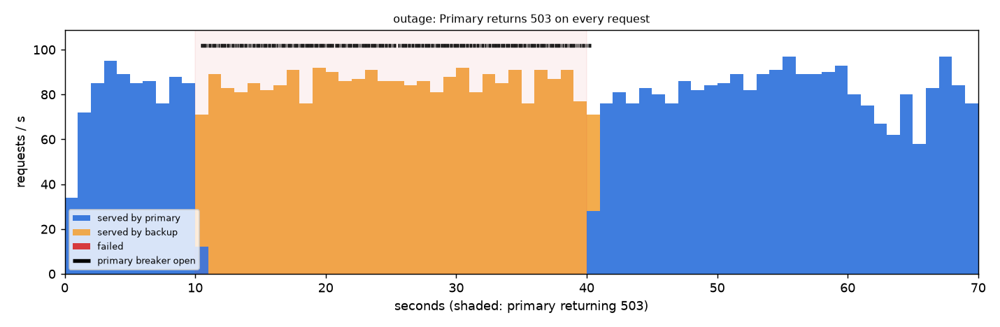
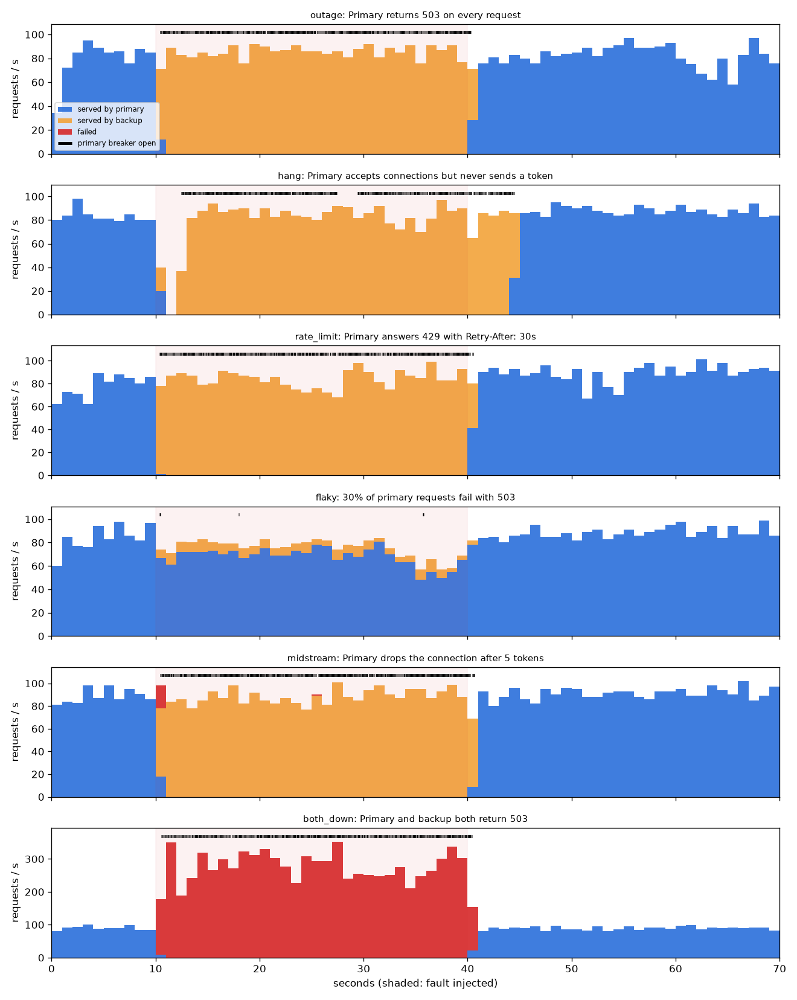

# Benchmarks

Every number here comes from a script in `bench/` against the mock provider,
and the raw results are in `docs/results/`. How to rerun them is in
[`bench/README.md`](../bench/README.md).

**Test machine:** one 4-vCPU, 16 GB Linux VM running everything at once: the
load generator, the mock provider (one process), Postgres, Redis, Prometheus,
Grafana and the gateway (2 worker processes, `GATEWAY_WORKERS=2`, in Docker).
Sharing the CPU matters for the results at high concurrency; see "What limits
throughput" below.

## 1. Overhead: how much latency does the gateway add?

Closed-loop load: N clients each stream a completion, then immediately start
another, for 20 s after a 3 s warm-up. The same load runs straight at the
mock, then through the gateway with everything on (auth, rate limits, budget,
breaker, routing, cost accounting, metrics, logging; response cache bypassed so
every request goes upstream). *Added* = gateway percentile minus direct
percentile. TTFT = time to first token as the client measures it.

**Realistic stream** (300 ms to first token, 60 tokens at 30 tokens/s, about 2.3 s per stream;
`docs/results/overhead-realistic.json`):

| Streams | Direct TTFT p50 / p95 / p99 (ms) | Through gateway | **Added p50 / p95 / p99** | Streams/s: gateway (direct) | Gateway CPU avg / max | Memory |
|---:|---|---|---|---|---|---|
| 10 | 314 / 323 / 325 | 329 / 362 / 384 | **+15 / +39 / +59** | 4 (4) | 23% / 65% | 579 MB |
| 100 | 377 / 485 / 537 | 414 / 523 / 563 | **+37 / +37 / +26** | 39 (40) | 103% / 169% | 588 MB |
| 500 | 1393 / 1679 / 1717 | 3898 / 6260 / 7003 | saturated | 92 (131) | 142% / 174% | 594 MB |
| 1000 | 2819 / 3769 / 3863 | 5896 / 9301 / 10635 | saturated | 105 (150) | 135% / 196% | 628 MB |

**Short, fast stream** (50 ms to first token, 40 tokens at 200 tokens/s: a stress test of per-token work;
`docs/results/overhead.json`):

| Streams | Direct TTFT p50 / p95 / p99 (ms) | Through gateway | **Added p50 / p95 / p99** | Streams/s: gateway (direct) | Gateway CPU avg / max | Memory |
|---:|---|---|---|---|---|---|
| 10 | 58 / 68 / 88 | 72 / 90 / 111 | **+14 / +22 / +23** | 34 (37) | 85% / 121% | 518 MB |
| 100 | 242 / 395 / 449 | 414 / 620 / 699 | **+171 / +225 / +250** | 135 (190) | 145% / 186% | 543 MB |
| 500 | 1351 / 1727 / 1767 | 3434 / 3738 / 3860 | saturated | 138 (201) | 144% / 201% | 565 MB |
| 1000 | 3105 / 3710 / 3813 | 7349 / 7940 / 8135 | saturated | 135 (216) | 147% / 183% | 592 MB |

CPU is `docker stats` for the gateway container (200% = both worker processes
busy). Memory includes the embedding model loaded in each process. No request
failed at any level.

### Reading it honestly

- **Below saturation the gateway adds 15–40 ms at the median.** That is the
  cost of the Redis round trips (rate limit, budget, breaker), one extra hop
  and re-encoding each chunk.
- **The ceiling on this box is about 100–140 new streams per second** with
  two worker processes, which is roughly 3,000 relayed tokens per second per
  process. Past that, requests queue and latency grows with concurrency. At
  500 and 1,000 streams the rows above measure queueing, not overhead. The
  direct baseline is itself saturated at those levels (its TTFT is 4–10x the
  mock's 300 ms), because the load generator and the mock share the same four
  cores.
- 1,000 concurrent *realistic* streams need about 430 new streams per second.
  From these numbers that is roughly 8–10 gateway processes, on cores that are
  not also running the load generator. The gateway is stateless, so that
  means more `GATEWAY_WORKERS` or more hosts; it is not a redesign.

### What limits throughput, and what was optimised

Profiling (`py-spy`) under 100 concurrent streams found, in order:

| Fix | Why |
|---|---|
| Drain the upstream body after `[DONE]` before closing | Closing an unfinished response makes httpx drop the connection; every request paid a new TCP handshake |
| Split each provider's connection pool into 16 shards | With keep-alive working, httpx's pool scanned every idle connection on each request; at a few hundred connections this was ~40% of CPU |
| One network read = one batch, one write to the client | Fewer generator steps and socket writes per token under load |
| `orjson`, byte-level SSE parsing, `hiredis` | Cheaper per-token parsing and Redis replies |
| No per-chunk `asyncio` timer | The HTTP client's read timeout already enforces the idle timeout |
| Several worker processes | One Python process tops out at about one core |

Same machine, same mock, **one** gateway process, fast stream
(`overhead-before-1proc.json` is the Phase 4 code, `overhead-after-1proc.json` the current code):

| | 10 streams: added TTFT p50 / p95 | 100 streams: added TTFT p50 / p95 | Max streams/s |
|---|---|---|---|
| Before | +17 / +34 ms | +784 / +832 ms | 83 |
| After | +13 / +23 ms | +503 / +540 ms | 98 |
| After, 2 processes (Docker) | +14 / +22 ms | +171 / +225 ms | 135 |

The single-process gain is modest (+18% throughput). What remains is mostly
the HTTP client's own per-request and per-chunk work and Redis round trips;
the next steps would be merging the rate-limit and budget scripts into one
call and measuring an alternative HTTP client.

## 2. Resilience: what do clients see when a provider fails?

`python -m bench.chaos`: 20 concurrent streaming clients against the `mock`
alias (mock-primary, then mock-backup), 10 s healthy, 30 s with the fault,
30 s after it is removed. Breaker: opens after 5 consecutive failures, 15 s
cooldown, then one probe. Hang scenario runs with a 2 s time-to-first-token
timeout (set through the admin API for the run). Results:
`docs/results/chaos.json`.

| Failure injected into the primary | Requests during fault | **Failed before first token** | Failed after first token | Served by backup | Breaker opened after | Back on primary after fault ended |
|---|---:|---:|---:|---:|---:|---:|
| Every request returns 503 | 2,559 | **0** | 0 | 99.5% | 0.41 s | 0.27 s |
| Accepts, never sends a token | 2,384 | **0** | 0 | 99.2% | 2.45 s | 4.43 s |
| 429 with `Retry-After: 30` | 2,520 | **0** | 0 | 99.96% | 0.36 s | 0.44 s |
| 30% of requests fail with 503 | 2,251 | **0** | 0 | 9.5% | 0.38 s (briefly) | n/a |
| Drops the connection after 5 tokens | 2,668 | **0** | 21 (0.8%) | 98.5% | 0.40 s | 0.66 s |
| Primary *and* backup return 503 | 8,317 | 8,309 (all) | 0 | none | 0.55 s | 0.33 s |

What the rows show:

- **Outage, 429s and random 5xx never reached a client.** Before the breaker
  opens, each request retries once and fails over; after it opens the primary
  is skipped entirely. TTFT during the outage (p50 88 ms, p95 133 ms) was the
  same as when healthy.
- **A hanging provider costs time, not errors.** Until the breaker opened,
  requests waited out the 2 s TTFT timeout before failing over (the dip at
  the start of the fault in the chart below). A shorter TTFT timeout shortens
  that window, at the risk of cutting off a slow but healthy provider.
- **Mid-stream failures cannot be hidden.** 21 clients had already received
  tokens when the primary dropped them; they got an explicit error event, not
  a truncated answer that looks complete. The first run of this scenario
  found a bug: the breaker counted a stream as healthy as soon as its first
  token arrived, so a provider that always failed after a few tokens kept
  closing its own breaker (281 client errors). The breaker now records a
  stream's outcome when the stream ends, and the same scenario drops to 21.
- **Recovery takes up to one cooldown (15 s).** "Back on primary" depends on
  where in the cooldown the fault ended; here the half-open probe happened to
  land within a second. The worst case is the cooldown length.
- **When everything is down, the gateway fails fast**: once both breakers
  were open, failed requests returned in 33 ms at the median (a clean 503),
  rather than each one waiting on dead providers.
- A flaky provider (30% errors) occasionally strings together 5 failures and
  trips the breaker for a cooldown; that is where the 9.5% backup traffic
  came from.

## 3. Semantic cache accuracy

`python -m bench.cache_eval`: all-MiniLM-L6-v2 (ONNX, CPU), cosine similarity.
Results: `docs/results/cache_eval.json`, plot: `docs/img/semantic_threshold.png`.

Data: 20,000 Quora Question Pairs (37% labelled duplicates), 180 hand-written
pairs (90 paraphrases, 90 near misses such as swapped direction or changed
numbers) and 70 held-out pairs written after the guard was frozen. "Wrong" in
the retrieval view means the closest cached question above the threshold is
from a different QQP duplicate cluster.

QQP as a cache (retrieval view, with the lexical guard):

| Threshold | Lookups that hit | Hits that were wrong | Wrong answers per 1,000 lookups |
|---:|---:|---:|---:|
| 0.90 | 26.9% | 20.3% | 54.6 |
| 0.95 | 14.6% | 10.5% | 15.4 |
| 0.97 | 10.1% | 7.2% | 7.2 |
| 0.98 | 8.0% | 5.2% | 4.2 |
| **0.99** | **6.0%** | **2.6%** | **1.6** |

The threshold is chosen by rule, not by eye: the lowest value with at most 2
wrong answers per 1,000 lookups, which gives **0.99**.

What embeddings get wrong: word order. "How do I convert a string to an
integer in JavaScript?" vs "...an integer to a string..." scores **0.996**.
The lexical guard (swapped direction around to/from/into/than, changed
numbers, a short list of common opposites) blocks those. On the held-out
pairs it still lets through about 1 wrong hit in 6 at 0.99 (for example
"time in London when it's noon in New York" vs the reverse, 0.996), which is
why the semantic cache stays off where answers must be exact.

Embedding cost: 8 ms per prompt on one CPU thread (5 ms per text batched).

## 4. Cost: caching on vs off

`python -m bench.cost_replay`: 3,000 non-streaming requests per run, 8 at a
time, each mode on a fresh tenant so caches start empty. Results:
`docs/results/cost_replay.json`.

- **faq**: 70% of requests ask one of 300 popular questions (Zipf popularity),
  each time phrased as a random member of that question's QQP duplicate
  cluster (real human rephrasings); 30% are one-off questions. 1,396 distinct
  prompts in 3,000 requests.
- **unique**: every request is a different question.

| Workload | Cache | Hit rate | Billed (at gpt-4o-mini prices) | At claude-haiku-4-5 prices | At gpt-4o prices | **Saved** | Wrong semantic hits |
|---|---|---:|---:|---:|---:|---:|---:|
| faq | off | 0% | $0.277 | $2.30 | $4.62 | n/a | n/a |
| faq | exact | 53.3% | $0.130 | $1.08 | $2.17 | **53.2%** | n/a |
| faq | exact + semantic | 53.7% | $0.129 | $1.07 | $2.15 | **53.6%** | 0 of 29 |
| unique | off | 0% | $0.279 | $2.31 | $4.64 | n/a | n/a |
| unique | exact + semantic | 0% | $0.279 | $2.31 | $4.64 | 0% | n/a |

Mean latency per request type (faq): exact hit 15 ms, miss 38 ms without the
semantic cache, **miss 93 ms with it**, semantic hit 70 ms.

Conclusions:

- **Savings track repetition, and the exact cache does almost all of it.**
  A workload where half the requests repeat word for word saves half the
  spend; a workload with no repeats saves nothing.
- **The semantic cache added 0.4 points** (29 hits, none wrong) because at a
  threshold of 0.99 only near-verbatim rephrasings match, while every miss
  paid about 55 ms for the embedding and vector search. That trade is why the
  shipped config has the semantic cache off; it is one line to enable.
- Routing is not compared: the gateway routes by configured fallback chain,
  not by price, so there is no "routing on" mode to measure yet.
